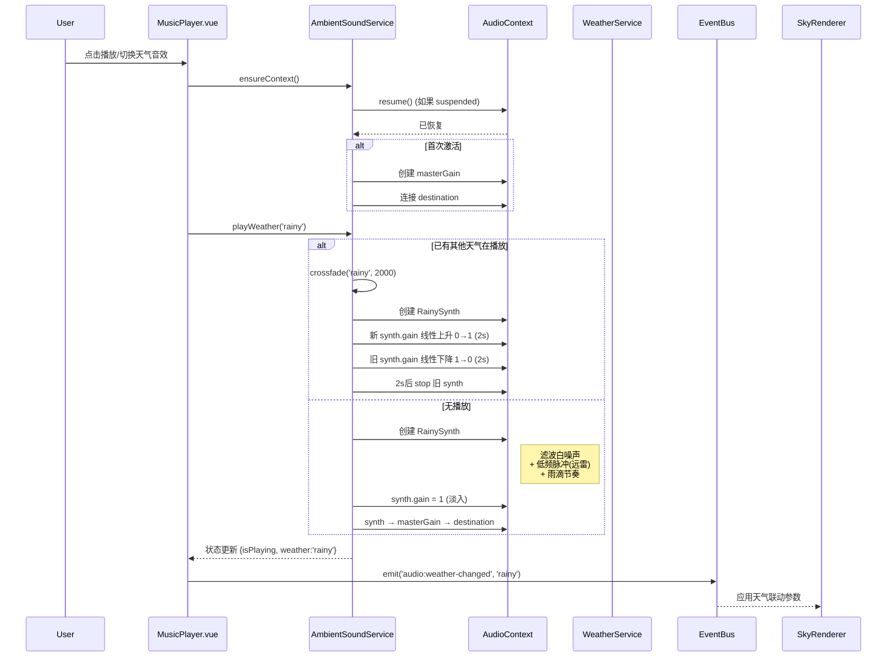
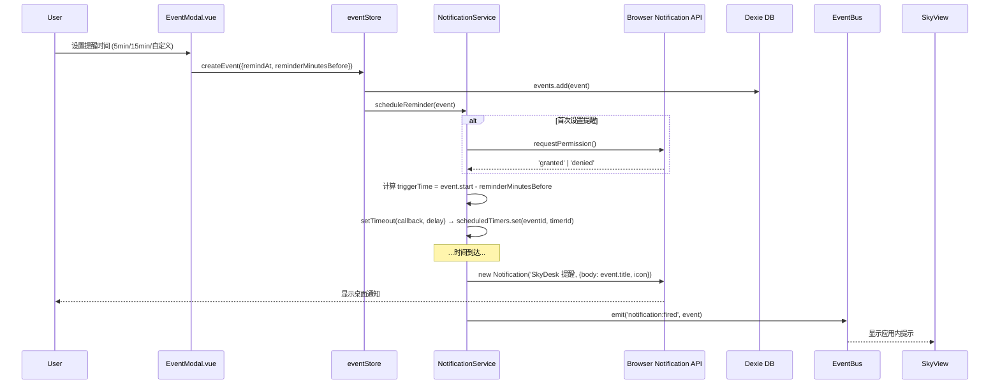
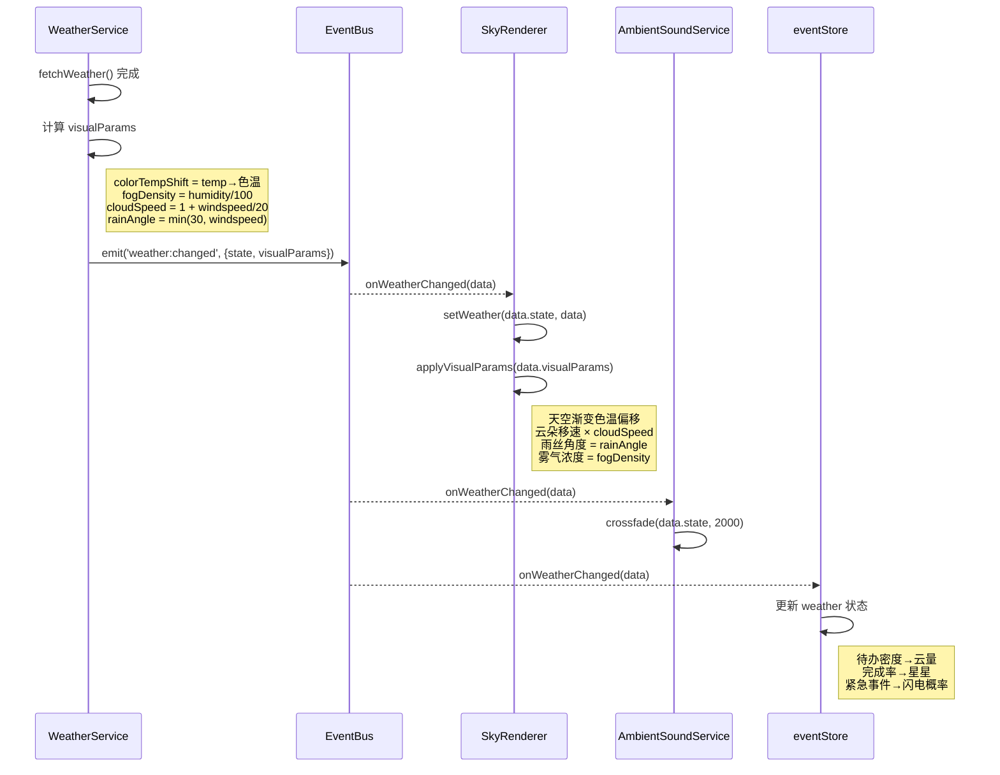
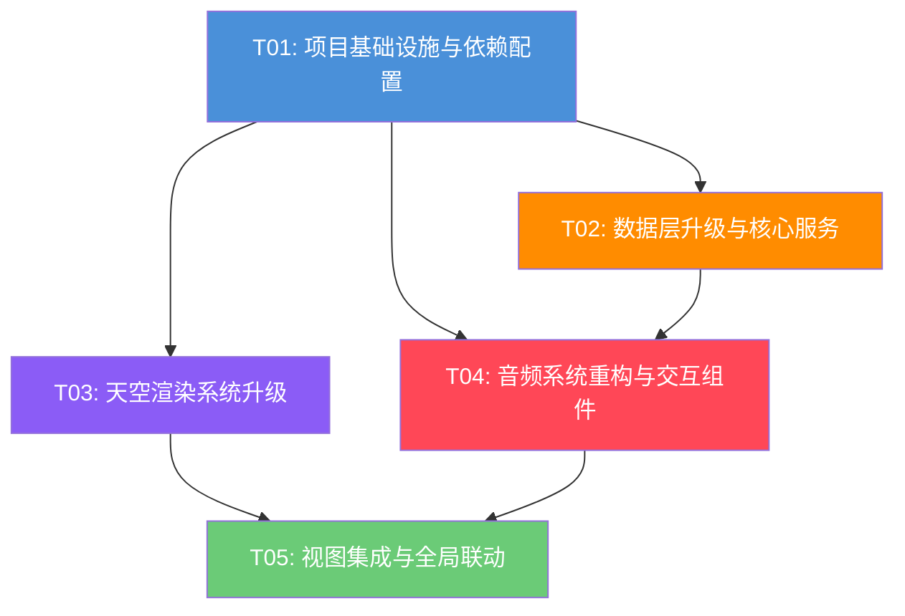

# SkyDesk 天空日程 — 系统架构升级设计

> 架构师：高见远（Gao） | 版本：v2.0 | 日期：2025-07

---

## 目录

1. [实现方案 + 框架选型](#1-实现方案--框架选型)
2. [文件列表及相对路径](#2-文件列表及相对路径)
3. [数据结构和接口（类图）](#3-数据结构和接口类图)
4. [程序调用流程（时序图）](#4-程序调用流程时序图)
5. [任务列表](#5-任务列表)
6. [共享知识](#6-共享知识)
7. [待明确事项](#7-待明确事项)
8. [任务依赖图](#8-任务依赖图)

---

## 1. 实现方案 + 框架选型

### 1.1 技术栈确认

| 层面 | 技术选型 | 说明 |
|------|---------|------|
| 框架 | Vue 3 (Composition API) | 保持不变，继续使用 `<script setup>` |
| 构建 | Vite 8 | 保持不变 |
| 本地存储 | Dexie.js 4 (IndexedDB) | 版本升级 v1→v2，新增 tags 表 |
| 路由 | Vue Router 4 | 保持不变 |
| 日期处理 | date-fns 4 | 已安装，扩展使用 |
| Canvas 渲染 | Canvas 2D API | 保持不变 |
| 音频 | Web Audio API | 替换死代码，零外部依赖 |

### 1.2 新增依赖

| 包名 | 版本 | 用途 |
|------|------|------|
| `simplex-noise` | ^4.0.1 | Perlin/Simplex noise 生成，用于云朵边缘扰动、雾气流动、月亮纹理 |
| `rrule` | ^2.8.1 | RFC 5545 RRule 重复事件规则生成与展开 |
| `mitt` | ^3.0.1 | 轻量事件总线（~200B），用于跨组件/跨服务通信 |

> **不引入**：Pinia（项目已用 Vue reactive 管理状态，引入成本高且无必要）、MUI/Tailwind（项目用 scoped CSS + Canvas，无 CSS 框架需求）。

### 1.3 关键架构决策

#### A. SkyBackground 共享组件化

**问题**：当前 SkyRenderer 仅在 SkyView 中使用，CalendarView 和 StatsView 无天空背景，视图割裂。

**决策**：抽取 `SkyBackground.vue` 作为共享组件，内部封装 SkyRenderer 生命周期管理。三个视图通过 props 传入差异化配置：

```
SkyBackground.vue
  props: { theme: 'day'|'night'|'auto', intensity: 0-1, weatherOverride: String }
  emits: ['cloud-click', 'cloud-hover']
```

- SkyView：`theme='auto'`, 完整交互（点击/悬停云朵）
- CalendarView：`theme='auto'`, 降低 intensity（半透明底），无云朵交互
- StatsView：`theme='night'`, 静态星空背景（Q4 默认夜空）

#### B. MusicService 重写策略

**问题**：MusicService 完全依赖 localhost:3000（NeteaseCloudMusicApi），全量死代码。

**决策**：**彻底删除** MusicService.js，新建 `AmbientSoundService.js`。架构如下：

```
AmbientSoundService (单例)
  ├── AudioContext（共享）
  ├── 4 种天气音效合成器
  │   ├── SunnySynth：鸟鸣（振荡器频率调制）+ 微风（滤波噪声）
  │   ├── RainySynth：雨声（滤波白噪声）+ 远雷（低频脉冲）
  │   ├── SnowySynth：风声（低通滤波噪声）+ 踩雪（短促噪声脉冲）
  │   └── FoggySynth：低频噪声 + 微弱风铃
  ├── 交叉淡入淡出（GainNode 线性插值，2s 过渡）
  └── 通知音效（复用现有 AudioManager 逻辑）
```

MusicPlayer.vue **保留 UI 结构**，但移除歌单/播放列表/曲目信息等 UI，改为天气音效选择面板：

- 4 个天气音效按钮（晴/雨/雪/雾）
- 音量滑块
- 播放/暂停控制
- 迷你状态条保留

#### C. Dexie 迁移方案

**问题**：当前 version(1)，events 表缺少 tagIds/remindAt/rrule 等字段。

**决策**：新增 version(2)，使用 Dexie `upgrader` 保留旧数据：

```js
this.version(2).stores({
  events: '++id, title, start, end, priority, completed, *tags, remindAt, rruleFreq',
  tags: '++id, name, color',
  habits: '++id, name, streak, bestStreak',
  settings: '++id, key'
}).upgrade(tx => {
  // 为已有 events 添加默认值
  return tx.table('events').toCollection().modify(event => {
    if (!event.tagIds) event.tagIds = []
    if (!event.remindAt) event.remindAt = null
    if (!event.rrule) event.rrule = null
  })
})
```

#### D. 事件总线方案

**决策**：使用 `mitt` 创建全局事件总线 `eventBus`，用于：

- 天气变化 → 通知所有消费者（SkyRenderer / AmbientSoundService / SkyBackground）
- 事件 CRUD → 通知 SkyRenderer 更新云朵/星星
- 通知触发 → 从 NotificationService → UI 提示
- 快捷键 → 从 App.vue → 各视图动作

事件名约定：`weather:changed`, `events:updated`, `notification:fired`, `shortcut:keydown`

#### E. 天气深度联动架构

**决策**：在 WeatherService 的 `_notify()` 中扩展 `current` 数据结构，新增 `visualParams` 计算属性：

```js
get visualParams() {
  return {
    colorTemp: this._tempToColorTemp(this.current.temp),     // → 天空渐变色温偏移
    fogDensity: this.current.humidity / 100,                  // → 雾气浓度
    cloudSpeed: 1 + (this.current.windspeed || 0) / 20,      // → 云朵移速倍率
    rainAngle: Math.min(30, (this.current.windspeed || 0)),   // → 雨丝角度
    starBrightness: ...                                        // → 完成率→星星亮度
  }
}
```

SkyRenderer 新增 `applyVisualParams(params)` 方法，在渲染循环中消费。

---

## 2. 文件列表及相对路径

### 2.1 新增文件

| 文件路径 | 说明 |
|---------|------|
| `src/services/perlinNoise.js` | Simplex noise 封装（基于 simplex-noise 库） |
| `src/services/AmbientSoundService.js` | Web Audio API 天气环境音效合成器 |
| `src/services/NotificationService.js` | Browser Notification API 封装 + 提醒调度 |
| `src/services/RecurrenceService.js` | 重复事件规则展开（基于 rrule 库） |
| `src/services/SearchService.js` | 全文搜索 + 组合过滤器 |
| `src/components/SkyBackground.vue` | 共享天空背景组件 |
| `src/components/SearchBar.vue` | 搜索过滤栏组件 |
| `src/components/ContextMenu.vue` | 右键上下文菜单组件 |
| `src/components/FloatingActionButton.vue` | 浮动添加按钮（统一交互语言） |
| `src/composables/useSkyRenderer.js` | SkyRenderer 生命周期管理 Composable |
| `src/composables/useKeyboardShortcuts.js` | 全局键盘快捷键 Composable |
| `src/composables/useWeatherSync.js` | 天气→视觉→音频联动 Composable |
| `src/utils/eventBus.js` | mitt 事件总线实例 |

### 2.2 修改文件

| 文件路径 | 改动范围 |
|---------|---------|
| `package.json` | 新增 simplex-noise, rrule, mitt 依赖 |
| `src/main.js` | 注册全局组件（SkyBackground, SearchBar, ContextMenu, FAB） |
| `src/App.vue` | 集成全局快捷键、事件总线、ContextMenu 宿主 |
| `src/services/db.js` | Dexie version(2) 迁移，新增 tags 表，events 新增字段 |
| `src/services/SkyRenderer.js` | Perlin noise 云朵边缘、god ray 太阳、月亮纹理、增强天气粒子、`applyVisualParams()` |
| `src/services/AudioManager.js` | 精简为通知音效专用，与 AmbientSoundService 共享 AudioContext |
| `src/services/WeatherService.js` | 新增 `visualParams` getter、天气深度联动数据 |
| `src/stores/eventStore.js` | 集成 SearchService、NotificationService、RecurrenceService，新增搜索/过滤状态 |
| `src/views/SkyView.vue` | 替换内联 Canvas 为 SkyBackground 组件，使用 composables |
| `src/views/CalendarView.vue` | 添加 SkyBackground 底层，统一交互语言（FAB/右键/拖拽） |
| `src/views/StatsView.vue` | 添加 SkyBackground 夜空背景 |
| `src/components/MusicPlayer.vue` | 重写为天气音效控制面板，移除歌单/播放列表 UI |
| `src/components/EventModal.vue` | 新增标签选择器、提醒时间设置、重复规则设置 UI |

### 2.3 删除文件

| 文件路径 | 原因 |
|---------|------|
| `src/services/MusicService.js` | 全量死代码，由 AmbientSoundService 替代 |

---

## 3. 数据结构和接口（类图）

```mermaid
classDiagram
    direction TB

    class SkyDeskDB {
        +events: Table
        +tags: Table
        +habits: Table
        +settings: Table
        +version(2)
    }

    class Event {
        +id: number
        +title: string
        +description: string
        +start: Date
        +end: Date
        +allDay: boolean
        +color: string
        +priority: string
        +completed: boolean
        +completedAt: Date|null
        +tagIds: number[]
        +remindAt: Date|null
        +reminderMinutesBefore: number|null
        +rrule: string|null
        +rruleEndCondition: object|null
        +parentId: number|null
        +location: string
        +createdAt: Date
        +updatedAt: Date
    }

    class Tag {
        +id: number
        +name: string
        +color: string
        +createdAt: Date
    }

    class Habit {
        +id: number
        +name: string
        +streak: number
        +bestStreak: number
        +records: Array
    }

    class Setting {
        +id: number
        +key: string
        +value: any
    }

    SkyDeskDB --> Event : events
    SkyDeskDB --> Tag : tags
    SkyDeskDB --> Habit : habits
    SkyDeskDB --> Setting : settings

    class SkyRenderer {
        +canvas: HTMLCanvasElement
        +ctx: CanvasRenderingContext2D
        +weatherState: string
        +weatherData: object
        +clouds: Cloud[]
        +stars: Star[]
        +rainDrops: RainDrop[]
        +snowFlakes: SnowFlake[]
        +sunMoon: SunMoon
        +perlinNoise: PerlinNoise
        +visualParams: VisualParams
        +onCloudClick: Function
        +onCloudHover: Function
        +init()
        +start()
        +stop()
        +setWeather(state, data)
        +applyVisualParams(params)
        +updateCloudsFromTodos(todos)
        +updateStarsFromCompleted(completed)
        +destroy()
    }

    class PerlinNoise {
        +noise2D(x, y): number
        +noise3D(x, y, z): number
    }

    class VisualParams {
        +colorTempShift: number
        +fogDensity: number
        +cloudSpeedMultiplier: number
        +rainAngle: number
        +starBrightnessMultiplier: number
        +lightningChance: number
    }

    SkyRenderer --> PerlinNoise : uses
    SkyRenderer --> VisualParams : consumes

    class AmbientSoundService {
        -audioContext: AudioContext
        -activeSynth: WeatherSynth|null
        -masterGain: GainNode
        -isPlaying: boolean
        -volume: number
        -currentWeather: string
        +init()
        +playWeather(weather: string)
        +crossfade(weather: string, duration: number)
        +stop()
        +toggle()
        +setVolume(v: number)
        +ensureContext()
        +destroy()
    }

    class WeatherSynth {
        +type: string
        +nodes: AudioNode[]
        +gainNode: GainNode
        +start()
        +stop()
    }

    AmbientSoundService --> WeatherSynth : creates

    class NotificationService {
        -permission: string
        -scheduledTimers: Map
        +requestPermission()
        +scheduleReminder(event: Event)
        +cancelReminder(eventId: number)
        +cancelAll()
        +fireNotification(event: Event)
        +checkUpcoming()
    }

    class RecurrenceService {
        +expandRule(rrule: string, start: Date, rangeStart: Date, rangeEnd: Date): Date[]
        +generateRRule(config: RecurrenceConfig): string
        +editSingleOccurrence(event: Event, changes: object): Event
        +editAllOccurrences(event: Event, changes: object): Event
    }

    class RecurrenceConfig {
        +freq: string
        +interval: number
        +until: Date|null
        +count: number|null
        +byday: string[]
    }

    RecurrenceService --> RecurrenceConfig : uses

    class SearchService {
        +search(query: string, events: Event[], filters: SearchFilters): Event[]
        -fuzzyMatch(text: string, query: string): boolean
        -matchTag(event: Event, tagIds: number[]): boolean
        -matchDateRange(event: Event, start: Date, end: Date): boolean
        -matchStatus(event: Event, status: string): boolean
    }

    class SearchFilters {
        +tagIds: number[]
        +dateStart: Date|null
        +dateEnd: Date|null
        +status: string
        +priority: string
    }

    SearchService --> SearchFilters : uses

    class WeatherService {
        +current: WeatherData
        +location: object
        +listeners: Function[]
        +fetchWeather(forceRefresh: boolean)
        +onChange(fn: Function)
        +getVisualParams(): VisualParams
        +getMusicMood(): string
        +getWeatherTip(): string
    }

    class WeatherData {
        +state: string
        +label: string
        +icon: string
        +temp: number
        +humidity: number
        +windspeed: number
        +isDay: boolean
    }

    WeatherService --> WeatherData : current
    WeatherService --> VisualParams : computes

    class SkyBackground {
        +props: SkyBackgroundProps
        +emits: cloud-click, cloud-hover
        +skyRenderer: SkyRenderer
    }

    class SkyBackgroundProps {
        +theme: string
        +intensity: number
        +weatherOverride: string
        +interactive: boolean
    }

    SkyBackground --> SkyRenderer : manages
    SkyBackground --> SkyBackgroundProps : receives

    class EventBus {
        +on(event: string, handler: Function)
        +off(event: string, handler: Function)
        +emit(event: string, data: any)
    }
```



---

## 4. 程序调用流程（时序图）

### 4.1 音乐系统启动流程



### 4.2 通知提醒触发流程



### 4.3 天气→视觉→音频联动流程



---

## 5. 任务列表

### 5.1 需要的包

```
- vue@^3.5.34: UI 框架（已有）
- vue-router@^4.6.4: 路由（已有）
- dexie@^4.4.3: IndexedDB 封装（已有）
- date-fns@^4.4.0: 日期处理（已有）
- vite@^8.0.12: 构建工具（已有）
- simplex-noise@^4.0.1: Perlin/Simplex noise 生成（新增）
- rrule@^2.8.1: 重复事件规则（新增）
- mitt@^3.0.1: 事件总线（新增）
```

### 5.2 任务分解（按依赖顺序）

---

#### T01: 项目基础设施与依赖配置

**描述**：安装新依赖、创建事件总线、更新入口文件、注册全局组件。这是所有后续任务的前置基础。

**涉及文件**：
- `package.json` — 新增 simplex-noise, rrule, mitt
- `src/utils/eventBus.js` — 新建，mitt 实例
- `src/main.js` — 注册全局组件（SkyBackground, SearchBar, ContextMenu, FAB）
- `src/App.vue` — 集成全局快捷键监听、事件总线接入、ContextMenu 宿主

**依赖**：无（首个任务）

**优先级**：P0

**预估复杂度**：S

---

#### T02: 数据层升级与核心服务

**描述**：Dexie v2 迁移（新增 tags 表、events 新增字段）、新建 NotificationService、RecurrenceService、SearchService，并更新 eventStore 集成这些服务。这是 P0-02/03/04/05 的核心实现。

**涉及文件**：
- `src/services/db.js` — Dexie version(2) 迁移，新增 tags 表，events 增加 tagIds/remindAt/rrule 索引
- `src/services/NotificationService.js` — 新建，Browser Notification API + 提醒调度
- `src/services/RecurrenceService.js` — 新建，基于 rrule 的重复事件展开/编辑
- `src/services/SearchService.js` — 新建，全文模糊搜索 + 组合过滤器
- `src/stores/eventStore.js` — 集成新服务，新增搜索/过滤/标签状态

**依赖**：T01（需要 eventBus）

**优先级**：P0

**预估复杂度**：L

---

#### T03: 天空渲染系统升级

**描述**：Perlin noise 云朵边缘扰动（P0-06）、太阳 god ray 体积光（P0-07）、月亮表面纹理（P0-07）、雨运动模糊/雪六角形/雾 Perlin 流动（P0-08）、天气深度联动参数接入（P1-01/05/06）、SkyBackground 共享组件抽取（P1-02）。这是视觉效果提升的核心任务。

**涉及文件**：
- `src/services/perlinNoise.js` — 新建，simplex-noise 封装
- `src/services/SkyRenderer.js` — 大幅增强：Perlin 云边缘、god ray、月亮纹理、增强天气粒子、`applyVisualParams()`
- `src/services/WeatherService.js` — 新增 `getVisualParams()` 计算属性
- `src/components/SkyBackground.vue` — 新建，共享天空背景组件
- `src/composables/useSkyRenderer.js` — 新建，SkyRenderer 生命周期 composable
- `src/composables/useWeatherSync.js` — 新建，天气→视觉→音频联动 composable

**依赖**：T01（需要 eventBus、simplex-noise）

**优先级**：P0

**预估复杂度**：L

---

#### T04: 音频系统重构与交互组件

**描述**：彻底重写音乐系统为 Web Audio API 环境音效（P0-01）、重写 MusicPlayer 为音效控制面板、新建搜索栏/右键菜单/浮动按钮（P1-03 交互统一）、更新 EventModal 支持 tags/提醒/重复（P0-02/03/04 UI 部分）。

**涉及文件**：
- `src/services/AmbientSoundService.js` — 新建，4 种天气音效合成 + 交叉淡入淡出
- `src/services/MusicService.js` — **删除**（死代码）
- `src/services/AudioManager.js` — 精简，与 AmbientSoundService 共享 AudioContext
- `src/components/MusicPlayer.vue` — 重写为天气音效控制面板
- `src/components/SearchBar.vue` — 新建，搜索过滤组件
- `src/components/ContextMenu.vue` — 新建，右键上下文菜单
- `src/components/FloatingActionButton.vue` — 新建，统一浮动添加按钮
- `src/components/EventModal.vue` — 增强：标签选择器、提醒时间、重复规则 UI

**依赖**：T01（需要 eventBus）、T02（需要 NotificationService、RecurrenceService、SearchService 接口）

**优先级**：P0

**预估复杂度**：L

---

#### T05: 视图集成与全局联动

**描述**：三个视图统一集成 SkyBackground 组件、统一交互语言（FAB/右键/拖拽）、键盘快捷键（P1-04）、日夜自动过渡（P1-06）、最终集成调试。

**涉及文件**：
- `src/views/SkyView.vue` — 重构：替换内联 Canvas 为 SkyBackground，使用 composables
- `src/views/CalendarView.vue` — 添加 SkyBackground 底层，统一交互
- `src/views/StatsView.vue` — 添加 SkyBackground 夜空背景
- `src/composables/useKeyboardShortcuts.js` — 新建，N/1/2/3/Esc/Space/快捷键
- `src/router/index.js` — 可能调整路由守卫（权限检查等）

**依赖**：T01（需要 eventBus）、T03（需要 SkyBackground 组件）、T04（需要交互组件）

**优先级**：P0 + P1

**预估复杂度**：M

---

### 5.3 需求→任务映射

| 需求 | 任务 |
|------|------|
| P0-01 音乐系统重构 | T04 |
| P0-02 通知提醒 | T02(服务) + T04(UI) |
| P0-03 重复事件 | T02(服务) + T04(UI) |
| P0-04 标签分类 | T02(DB+服务) + T04(UI) |
| P0-05 搜索过滤 | T02(服务) + T04(UI) |
| P0-06 云朵质感增强 | T03 |
| P0-07 太阳/月亮质感增强 | T03 |
| P0-08 雨/雪/雾质感增强 | T03 |
| P1-01 天气深度联动 | T03 |
| P1-02 视图统一-天空背景 | T03(组件) + T05(集成) |
| P1-03 视图统一-交互语言 | T04(组件) + T05(集成) |
| P1-04 键盘快捷键 | T05 |
| P1-05 事件-视觉双向绑定 | T03(SkyRenderer) + T05(联动) |
| P1-06 日夜自动过渡 | T05 |

> P2 需求（PWA/导出/引导/偏好）不在本次任务范围内，可在 T01-T05 完成后以追加任务形式处理。

---

## 6. 共享知识

### 6.1 命名规范

| 类别 | 规范 | 示例 |
|------|------|------|
| 组件文件 | PascalCase | `SkyBackground.vue`, `SearchBar.vue` |
| 服务文件 | PascalCase | `AmbientSoundService.js`, `NotificationService.js` |
| Composable | use 前缀 + PascalCase | `useSkyRenderer.js`, `useKeyboardShortcuts.js` |
| 工具文件 | camelCase | `eventBus.js`, `perlinNoise.js` |
| 事件名 | domain:action | `weather:changed`, `events:updated` |
| Dexie 表 | 复数小写 | `events`, `tags`, `habits`, `settings` |
| CSS 变量 | --skydesk-前缀 | `--skydesk-accent`, `--skydesk-glass-bg` |

### 6.2 事件总线约定

```js
// 事件名格式：domain:action
'weather:changed'       // { state, visualParams, raw }
'events:updated'        // { action: 'create'|'update'|'delete', event }
'notification:fired'    // { event, type }
'audio:weather-changed' // { weather, isPlaying }
'shortcut:keydown'      // { key, modifiers }
```

### 6.3 CSS 变量约定

```css
:root {
  --skydesk-accent: #7ee8fa;
  --skydesk-accent-alt: #4a90d9;
  --skydesk-glass-bg: rgba(255, 255, 255, 0.1);
  --skydesk-glass-border: rgba(255, 255, 255, 0.08);
  --skydesk-glass-blur: 16px;
  --skydesk-dark-bg: rgba(10, 10, 30, 0.85);
  --skydesk-radius: 16px;
  --skydesk-radius-sm: 10px;
  --skydesk-font: -apple-system, "PingFang SC", sans-serif;
}
```

### 6.4 Dexie 数据约定

- 所有日期存储为 JS `Date` 对象（Dexie 自动处理 IndexedDB 序列化）
- 事件的 `rrule` 字段存储为 RFC 5545 字符串（如 `FREQ=WEEKLY;BYDAY=MO,WE,FR`）
- `tagIds` 使用 Dexie 的 `*` 多值索引支持按标签查询
- `remindAt` 为 Date 或 null，`reminderMinutesBefore` 为数字（5/15/30/60/自定义）

### 6.5 Web Audio API 约定

- AudioContext 单例，由 AmbientSoundService 持有
- AudioManager 的通知音效共享同一 AudioContext（通过 `getAudioContext()` 获取）
- 首次播放需要用户交互激活（`ensureContext()` 内调用 `resume()`）
- 所有 GainNode 操作使用 `linearRampToValueAtTime` 实现平滑过渡
- 交叉淡入淡出默认 2 秒

### 6.6 通知约定

- 首次设置提醒时请求 `Notification.requestPermission()`
- 通知图标使用 SkyDesk logo（如有）或默认图标
- 通知点击后聚焦应用窗口并跳转到对应事件
- 使用 `setTimeout` 调度本地提醒（应用关闭后不触发，这是已知限制）
- P2 可考虑 Service Worker 推送弥补离线通知

### 6.7 重复事件编辑约定

- 默认仅编辑当前这一次（创建新单次事件，原事件设 rrule 排除日期）
- 提供"编辑全部"选项（修改 rrule 规则）
- 删除同上：默认仅删除本次，可选删除全部

---

## 7. 待明确事项

| 编号 | 问题 | 当前假设 | 影响 |
|------|------|---------|------|
| Q1 | 通知授权时机 | 首次设置提醒时请求 | NotificationService 需延迟请求 |
| Q2 | 重复事件编辑默认行为 | 默认仅此一次 | RecurrenceService 需支持排除日期 |
| Q3 | 环境音效自动播放 | 需要一次用户点击激活 AudioContext | AmbientSoundService 初始化为暂停状态 |
| Q4 | StatsView 天空主题 | 默认夜空 | SkyBackground props `theme='night'` |
| Q5 | Dexie 迁移 | 必须迁移，保留旧数据 | version(2) upgrader 中为旧字段补默认值 |
| Q6 | god ray 实现方案 | Canvas 2D 径向模糊 + 合成模式 | 性能考虑：仅日出日落时渲染，30fps 下可接受 |
| Q7 | PWA 支持 | P2 暂不实现 | 后续追加 Service Worker + manifest |
| Q8 | 现有 EventModal 样式 | 当前白色背景，与天空主题不搭 | 重写为暗色玻璃态，与 SkyView 统一 |

---

## 8. 任务依赖图



**关键路径**：T01 → T02 → T04 → T05（最长依赖链）

**可并行**：T02 和 T03 在 T01 完成后可并行开发（无互相依赖）

---

## 附录 A：AmbientSoundService 音效合成方案

### 晴天 (SunnySynth)
- **微风**：低通滤波白噪声，截止频率 400-800Hz，低音量
- **鸟鸣**：正弦波频率调制，随机间隔 2-5 秒，频率 1500-3000Hz 快速正弦调制

### 雨天 (RainySynth)
- **雨声**：带通滤波白噪声，中心频率 2000Hz，Q=0.5
- **远雷**：低频（60-100Hz）振荡器 + 指数衰减，随机间隔 8-20 秒

### 雪天 (SnowySynth)
- **风声**：低通滤波噪声，截止频率 600Hz，缓慢 LFO 调制
- **踩雪**：短促噪声脉冲（50ms），极低音量

### 雾天 (FoggySynth)
- **低频嗡鸣**：60Hz 正弦波 + 谐波，极低音量
- **风铃**：2000-4000Hz 正弦波，随机触发，快速衰减

### 交叉淡入淡出
```
时间线: ─────────────────────────────>
旧音效: ████████████▓▓▓▓░░░░         (gain: 1 → 0, 2s)
新音效:         ░░░░▓▓▓▓████████████  (gain: 0 → 1, 2s)
```

---

## 附录 B：SkyRenderer 增强要点

### 云朵 Perlin 边缘扰动（P0-06）

当前：贝塞尔路径固定隆起
升级：每个 puff 的控制点添加 `noise2D(cx + t*0.1, cy + t*0.1) * amplitude` 时间扰动

```js
// 伪代码
const t = performance.now() * 0.0003
puffs.forEach(p => {
  const nx = this.noise.noise2D(p.cx * 0.01 + t, p.cy * 0.01)
  const ny = this.noise.noise2D(p.cx * 0.01, p.cy * 0.01 + t)
  p.cx += nx * 3  // 微小扰动
  p.topR += ny * 2
})
```

### 太阳 God Ray 体积光（P0-07）

```js
drawGodRays(ctx, x, y, time) {
  // 仅日出日落时段
  // 1. 从太阳中心发射 8-12 条径向渐变线
  // 2. 使用 globalCompositeOperation = 'lighter' 叠加
  // 3. 线条宽度随 Perlin noise 变化
  // 4. 透明度随距离太阳的偏角衰减
}
```

### 月亮表面纹理（P0-07）

```js
drawMoonTexture(ctx, x, y, r) {
  // 1. 创建离屏 Canvas 缓存纹理
  // 2. 用 Perlin noise 3D 生成月海暗区
  // 3. 迭代调用 noise3D(x, y, z) z=固定种子
  // 4. noise < 0.3 → 深色月海, noise < 0.6 → 浅色高地
  // 5. 叠加到月亮径向渐变之上
}
```

### 雨运动模糊（P0-08）

当前：直线 `moveTo → lineTo`
升级：增加 `ctx.lineWidth = 1.5`，`ctx.globalAlpha` 随速度变化，尾巴使用渐变线段

### 雪六角形（P0-08）

当前：圆点
升级：大雪花（size > 2）绘制六角形，6 条等角辐射线 + 末端分叉

### 雾 Perlin 流动（P0-08）

当前：3 层线性渐变平移
升级：每层添加 `noise2D(x + t, layer)` 采样，形成起伏流动的雾带

---

## 附录 C：Dexie v2 迁移详细 Schema

```js
// version(2) 新 schema
this.version(2).stores({
  events: '++id, title, start, end, priority, completed, *tags, *tagIds, remindAt, rruleFreq',
  tags: '++id, name, color',
  habits: '++id, name, streak, bestStreak',   // 不变
  settings: '++id, key'                        // 不变
}).upgrade(tx => {
  // 为已有 events 添加新字段默认值
  return tx.table('events').toCollection().modify(event => {
    if (!event.tagIds) event.tagIds = []
    if (!event.remindAt) event.remindAt = null
    if (!event.reminderMinutesBefore) event.reminderMinutesBefore = null
    if (!event.rrule) event.rrule = null
    if (!event.rruleFreq) event.rruleFreq = null
    if (!event.rruleEndCondition) event.rruleEndCondition = null
    if (!event.parentId) event.parentId = null
  })
})
```

**events 表新增索引**：
- `*tagIds`：多值索引，支持按标签 ID 查询
- `remindAt`：支持按提醒时间排序查询即将到期的提醒
- `rruleFreq`：支持按重复频率筛选

**tags 表**：
- `name`：标签名称（唯一，应用层校验）
- `color`：标签颜色（hex 字符串）
